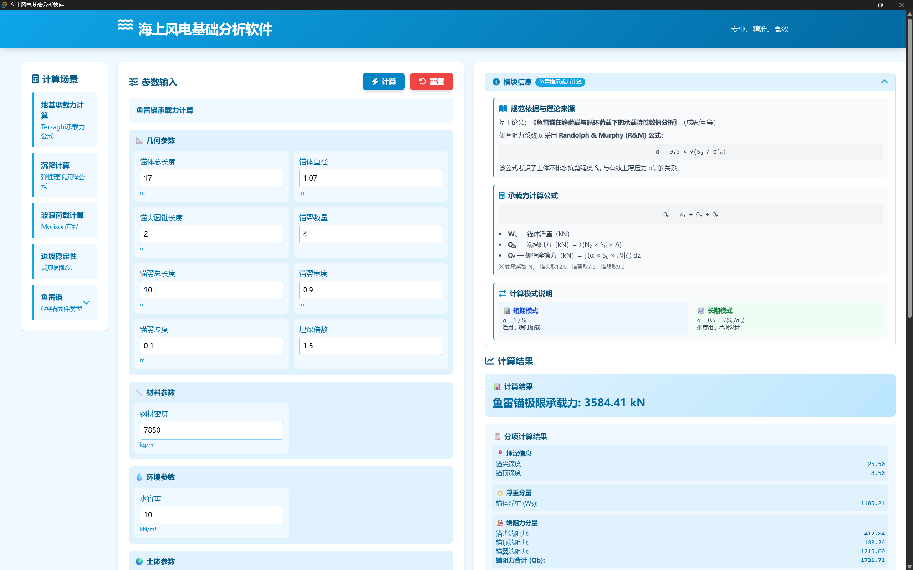

# 海上风电基础分析软件

一款面向海上风电基础结构的轻量化、集成化、透明化设计分析一体化计算软件，聚焦海上风电固定式 / 漂浮式基础的沉贯安装、承载力计算等核心需求，融合多体系规范，实现快速方案比选与关键指标计算。

开发团队：华南理工大学 海洋科学与工程学院



## 项目简介
本软件针对海上风电基础结构计算领域规范庞杂、轻量化工具缺失的行业痛点开发，支持重力锚、吸力锚、鱼雷锚、板锚、拖曳锚、桩锚等多类型海上风电基础计算，覆盖地基承载力、沉降计算、波浪荷载、边坡稳定、锚固件分析等核心模块，具备秒钟级快速求解、软件便捷易用的特点，为海上风电基础前期设计方案比选、安全评估与优化设计提供技术支撑。

## 目录结构
本项目采用前端模块化架构设计，按功能拆分独立模块，各模块分为参数配置、计算逻辑、输出渲染、校核功能、信息展示5个模块的标准包装，保证代码解耦性与可维护性，核心目录结构如下：
```text
海上风电基础分析软件/
│
├── index.html                              # 主入口页面
│
├── css/
│   └── style.css                           # 全局样式（响应式布局、固定侧边栏、折叠动画等）
│
├── js/
│   ├── main.js                             # 主入口模块（模块路由、事件绑定、计算分发）
│   │
│   ├── utils/                              # 全局工具函数目录
│   │   ├── formGenerator.js                # 表单生成器（支持条件显示、分组表单）
│   │   ├── resultRenderer.js               # 结果渲染主入口（分发器）✅ 已修复子场景路由
        ├── conditionManager.js             # 条件显示工具               
│   │   └── validator.js                    # 校验工具主入口（统一分发）✅ 已修复子场景路由
│   │
│   ├── Anchor/                             # 锚固件模块根目录
│   │   │
│   │   ├── index.js                        # 锚固件统一注册表
│   │   │
│   │   ├── shared/                         # 共享资源（所有锚固件共用）
│   │   │   ├── baseValidator.js            # 校验基类（ValidationResult + 通用规则）
│   │   │   └── baseRenderer.js             # 渲染基类（通用渲染函数、格式化、参数摘要）
│   │   │
│   │   ├── gravityAnchor/                  # ✅ 重力锚模块
│   │   │   ├── config.js
│   │   │   ├── calculator.js
│   │   │   ├── validator.js
│   │   │   ├── renderer.js
│   │   │   └── infoContent.js
│   │   │
│   │   ├── torpedoAnchor/                  # ✅ 鱼雷锚模块（已重构为子场景架构）
│   │   │   ├── index.js                    # 模块入口 + 子场景切换逻辑
│   │   │   │
│   │   │   ├── vertical-capacity/          # 子场景1：竖向承载力计算
│   │   │   │   ├── config.js               # 参数配置（id: vertical-capacity）
│   │   │   │   ├── calculator.js           # 计算逻辑（Randolph & Murphy公式）
│   │   │   │   ├── validator.js            # 校验规则
│   │   │   │   ├── renderer.js             # 结果渲染
│   │   │   │   └── infoContent.js          # 模块信息展示
│   │   │   │
│   │   │   ├── horizontal-capacity/        # 子场景2：水平承载力计算（占位）
│   │   │   │   ├── config.js
│   │   │   │   ├── calculator.js
│   │   │   │   ├── validator.js
│   │   │   │   ├── renderer.js
│   │   │   │   └── infoContent.js
│   │   │   │
│   │   │   └── penetration/                # 子场景3：安装贯入深度预测（占位）
│   │   │       ├── config.js
│   │   │       ├── calculator.js
│   │   │       ├── validator.js
│   │   │       ├── renderer.js
│   │   │       └── infoContent.js
│   │   │
│   │   ├── plateAnchor/                    # ✅ 板锚模块
│   │   │   ├── config.js
│   │   │   ├── calculator.js
│   │   │   ├── validator.js
│   │   │   ├── renderer.js
│   │   │   └── infoContent.js
│   │   │
│   │   ├── pileAnchor/                     # ✅ 桩锚模块
│   │   │   ├── config.js
│   │   │   ├── calculator.js
│   │   │   ├── validator.js
│   │   │   ├── renderer.js
│   │   │   └── infoContent.js
│   │   │
│   │   ├── dragAnchor/                     # ✅ 拖曳锚模块
│   │   │   ├── config.js
│   │   │   ├── calculator.js
│   │   │   ├── validator.js
│   │   │   ├── renderer.js
│   │   │   └── infoContent.js
│   │   │
│   │   └── suctionAnchor/                  # ✅ 吸力锚模块（子场景架构）
│   │       ├── index.js                    # 模块入口 + 子场景切换逻辑
│   │       ├── shared/                     # 吸力锚内部共享
│   │       │   └── suctionUtils.js
│   │       ├── installation-clay/          # 安装计算（黏土）
│   │       │   ├── config.js
│   │       │   ├── calculator.js
│   │       │   ├── validator.js
│   │       │   ├── renderer.js
│   │       │   └── infoContent.js
│   │       ├── installation-sand/          # 安装计算（砂土）
│   │       │   ├── config.js
│   │       │   ├── calculator.js
│   │       │   ├── validator.js
│   │       │   ├── renderer.js
│   │       │   └── infoContent.js
│   │       └── capacity-clay/              # 承载力计算（黏土）
│   │           ├── config.js
│   │           ├── calculator.js
│   │           ├── validator.js
│   │           ├── renderer.js
│   │           └── infoContent.js
│   │
│   ├── bearing/                            # 地基承载力模块
│   │   └── bearing.js
│   │
│   ├── settlement/                         # 沉降计算模块
│   │   └── settlement.js
│   │
│   ├── wave/                               # 波浪荷载模块
│   │   └── wave.js
│   │
│   └── slope/                              # 边坡稳定模块
│       └── slope.js
│
└── assets/                                 # 静态资源目录
    ├── algorighm/                          # 算法实现代码参考
    ├── docs/                               # 项目说明文档
    └── pics/                               # 原理图、图标等图片
```

## 核心功能
- 多类型基础计算：支持重力锚、吸力锚、鱼雷锚、板锚、拖曳锚、桩锚等全品类海上风电锚固件计算；
- 多模块覆盖：集成地基承载力、沉降计算、波浪荷载、边坡稳定等海上风电设施基础分析的核心场景计算能力；
- 可视化输出：实现计算结果分项 + 总项展示，结合数形结合方式，方便结果校核与分析；
- 规范适配：各个模块基于各自当前最前沿、最权威的规范和理论进行归纳和整理，保证分析工具的可靠性和合理性。

## 开发规范
- 代码统一采用国际单位制进行计算；
- 所有计算公式标注规范出处，实现规范中安全系数、分项系数；
- 代码添加详细注释，保证可读性与可维护性；
- 统一编程语法习惯，便于模块汇总与集成。

## 技术栈
### 软件技术框架：web框架
前端原生技术（HTML/CSS/JavaScript），无第三方重型框架依赖，保证轻量化与运行效率。

### 软件生产工具：Vite和Tauri
生产流程：
- 使用Vite对项目资源进行打包，得到软件压缩打包的dist/。
- 配置Tauri，对dist/内容进行打包并生成可执行文件。


## 开发日志

### 2026.4.19
+ 软件已初步集成的模块：鱼雷锚、板锚、桩锚、拖曳锚、重力锚（实现基本计算功能，结果展示和信息模块展示）。
+ 新增警告模块功能：软件可以对不合理的输入参数（如负值，0值）进行警告并阻止计算，当输出结果异常时也有警告提示
+ 关于吸力锚：经评估，吸力锚模块的内容比较多，我们认为需要将吸力锚一个模块分为3个子场景来管理，目前正在验证脚本中，但软件架构已搭建和占位。
+ 重构了源代码的目录结构和管理方式，现在各个模块的模块化和标准化程度更高，之后可以更容易地分工和管理各个模块的开发了。
+ 已构建github仓库，便于后续团队参与协助开发和代码迭代管理。


### 2026.5.14
（1）信息展示区内容统一：1、理论来源，列出采用的规范，文献等，其中文献要以参考文献的格式呈现，建议用国标（可在知网查到）。2、核心数学公式（仅列出核心部分，不需要所有细节公式），建议统一风格。3、锚固件结构或原理图。4、其他内容

（2）输入参数区：所有的参数都要同时有符号和中文说明

（3）修正了重力锚的计算逻辑问题
